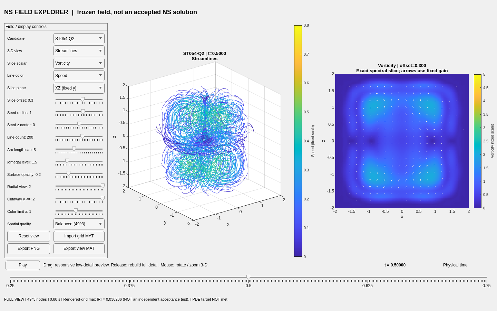

# 可视化统一入口

**交互 MATLAB 入口：[matlab/ns_explorer.m](matlab/ns_explorer.m)。完整操作说明：[MATLAB README](matlab/README.md)。**

```matlab
addpath('visualization/matlab');
ns_explorer;
```

新的统一入口展示冻结 ST054-Q2 / ST054-M3，支持下方连续时间条、三维流线、涡量等值面、
速度/压力/涡量/残差切片，以及起点、密度、长度、切片位置和内部剖视等显示控制。
MAT 数据已随代码保存，正常运行不需要 Python。ST054 是本次锁定的可复现可视化快照；
它不替换 `research_baseline.load_best()` 的 main 发布基线，也不宣称是所有并行研究中的全局最好场。



## 现有内容如何选择

| 入口 | 数据来源/用途 | 关键边界 |
|---|---|---|
| `matlab/ns_explorer.m` + `matlab/data/st054_models.mat` | ST054-Q2/M3 的原生连续时间谱求值 | 本次推荐交互入口；冻结场未通过原 NS 动量门槛 |
| `matlab/ns_import_grid.m` | PR #665 风格的 `[time,x,y,z]` 速度网格 | 可查看 ST052 导出；插值/差分，不提供缺失的压力和完整 NS 残差 |
| 原研究分支的 `scripts/verify_st052_grid_export.py` | ST052 导出布局/原始网格校验 | 继续保留原分支和收据，不被查看器替代 |
| 历史 `visualize_ns_candidate_streamlines_200_colored_fast.m` | 早期 optimized_v4 的流线实现，来自 Library/聊天附件 | 不是 ST054 公式；不混用旧参数和新验证数值 |
| 聊天中的 ST054 HTML / PNG | 早先的切片与离散帧快照 | 保留历史，不作为新版 MATLAB 数据/渲染依赖 |

这是对本轮实际核查入口的非破坏性整理，不宣称枚举了所有远端分支中的全部可视化文件。
没有删除旧分支、移动其他 agent 的模块、覆盖研究参数或自动合并科学 PR 栈。

## 准确性与测试

MAT 数据来自固定科学提交 `c77492a48e9c0f13d4d51244987c57c28519409b`。
`matlab/ns_selftest.m` 比较原 Python 求值器与 MATLAB 原生公式的速度、压力和完整残差；
另检验体网格布局、边界、轴对称、压力梯度和涡量。`ns_callback_test.m` 调用实际拖动/松开回调和播放定时器。
已执行的 MATLAB 版本、测试结果和实际界面截图见 [原生测试输出](matlab/tests/output/)，
未来 PR/主分支检查使用只读 CI，不向仓库自动写入实验参数。

绘图网格上的残差峰值不是独立科学验收，更不是连续时空上界。流线是固定时刻的积分曲线，
不是沿真实时间积分的粒子轨迹。除时间变量外，所有滑动条只改变观察/显示设置。
