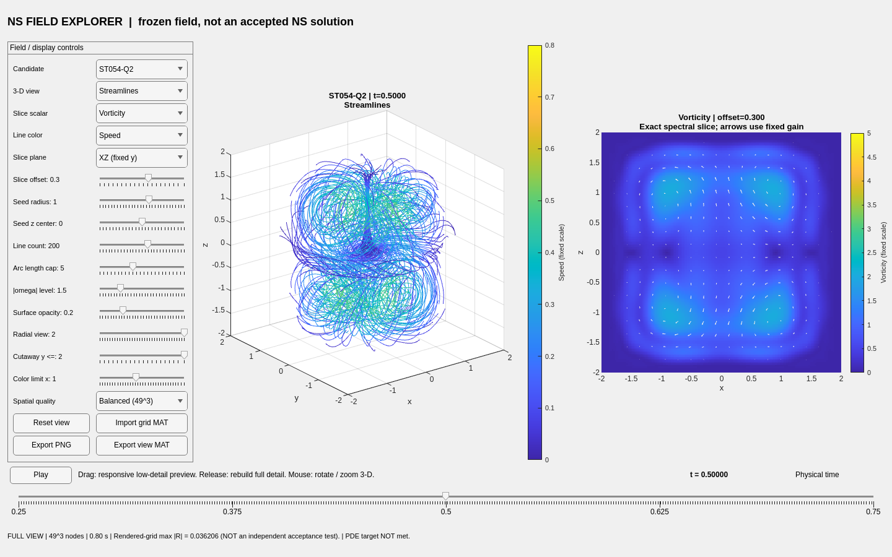

# Visualization hub

Choose the field, source commit and dataset first. A newer construction milestone does not change the coefficients in an older viewer.

## ST073 visualization boundary

The current ST073 branch records source-bound profile/pulse/outer components and leading moment closure. It does **not** yet establish a complete independently validated three-dimensional time-dependent field or the full temporal scale-recursion diagnostics. The main ST054 viewer and ST063 comparison must not be labeled as ST073 output. See [current status](../docs/RESEARCH_STATUS.md) and [research checkout](../docs/CURRENT_CHECKPOINT.md).

Future ST073 exports should bind every frame to the same source/parameter family, physical coordinate map, time and derivative availability. Report missing pressure or derivative data rather than borrowing it from a different field.

## Latest ST063 parent/child comparison

This is the historical numerical geometry track, not the latest ST073 construction. **Fields:** ST061-P, ST063-G1R and ST063-G2R. The default comparison is parent versus G2R. Use the already delivered **`NS_ST063_MATLAB_Comparison.zip`**, extract it, enter the `NS_ST063_MATLAB_Comparison` directory in MATLAB and run:

```matlab
start_here
```

The package includes `st063_models.mat`, its evaluator and `ns_compare_core.m`. The source branch alone does not include every array or dependency. Source and study are pinned at `a3d04d3467361bab7c9fc7c8c6aedf31987ee069`:

- [Comparison source](https://github.com/Liang-techh/OpenAI-NS-Velocity-Field-Reconstruction1/blob/a3d04d3467361bab7c9fc7c8c6aedf31987ee069/visualization/matlab/ns_compare_core.m)
- [Original study record](../docs/research_snapshots/ST063.md)
- [Bundle and candidate hashes](../docs/research_catalog.json)

Both sides share physical axes, camera, time, 200 seed locations, absolute thresholds and color limits. The time slider evaluates the original time polynomials. Streamlines are instantaneous curves, not material particle paths.

**Evidence limit:** the new ST063 MATLAB UI was not run natively in that study. Its reported MAT/reference checks and Python previews are separate evidence. The 0.15 threshold gives the reported moderate-strength axis-spanning band; high-threshold strong-core continuity at 0.25/0.35 was not achieved. The central disk remains.

## Viewer bundled on main: ST054

For the existing ST054-Q2/M3 data:

```matlab
addpath('visualization/matlab');
ns_explorer;
```

[Controls](matlab/README.md) · [Original native execution record](matlab/VERIFICATION.md)



This screenshot and native-test history belong to ST054, not ST063 or ST073. The dataset and viewer are unchanged. Moving seeds or changing the display range changes the view, not the physics.

## Controlled comparison and history

Keep physical axis ratio, camera, seeds, time and absolute thresholds fixed between fields. Show unfavorable thresholds and volume L2 as well as favorable geometry. Window-dependent moments and plotted curves are not continuous NS certificates.

The recorded ST063-G2R aspect improvement is 3.5%–7.3%, not the unachieved 10%–20% aspiration, and both original momentum gates fail. See [preserved results](../docs/LEGACY_NUMERICAL_RESULTS.md).

Imported ST052 grids remain interpolated velocity data; do not invent missing pressure or residuals. Older optimized_v4 scripts and HTML/PNG outputs remain historical demonstrations. No viewer, array, screenshot or native-test receipt is regenerated or scientifically promoted by this documentation update.
